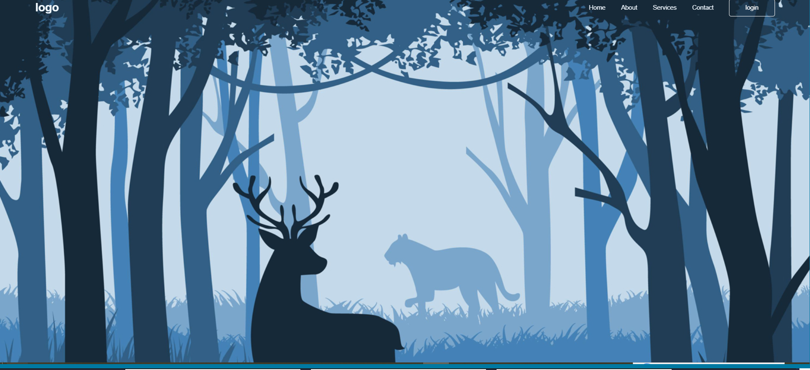

# First Website Project

  

## 📌 Project Overview

This is a foundational static website project built using HTML, CSS, and JavaScript.  
It highlights core frontend development skills, including:

- Structuring content with semantic HTML
- Styling layout and UI with CSS
- Adding interactivity using JavaScript (if present)
- Deploying a static website

This project is an excellent representation of understanding basic web fundamentals and is suitable for showcasing in portfolios and job applications.

---

## 🛠️ Technologies Used

| Layer | Technology |
|-------|------------|
| Markup | HTML |
| Styling | CSS |
| Interactivity | JavaScript |

These are the key languages used to build modern web interfaces.

---

## 📁 Project Structure

First-website/
│
├── index.html
├── style.css
├── script.js
├── README.md
└── public/
    └── first-website-preview.png
- index.html — Main webpage structure  
- style.css — CSS for UI styling  
- script.js — JavaScript logic for interactivity  
- public/first-website-preview.png — Preview image

---

## 📥 Installation & Local Usage

1. Clone the repository:

git clone https://github.com/jawasakher/First-website.git
2. Open the project folder.
3. View the website by opening:

index.html
in your browser.

---

## 🧠 Key Practices Demonstrated

The project demonstrates:

✔ Semantic HTML structure  
✔ CSS styling and layout principles  
✔ Basic JavaScript interactions  
✔ Separation of concerns between HTML, CSS, and JS  
✔ Ability to build and host a static site (e.g., with GitHub Pages) 0

These skills are fundamental for junior frontend roles.

---

## 📸 Screenshot Preview

Include a visual preview by adding:

/public/first-website-preview.png
This helps recruiters and hiring managers quickly understand the UI without running the code.

---

## 🚀 Possible Enhancements

To elevate this project for professional portfolios:

- Add responsive design (mobile layout)
- Add navigation links or multi-page structure
- Add form handling or interactive UI elements
- Convert layout to CSS Grid or Flexbox
- Deploy live with GitHub Pages

---

## 👤 About the Developer

Jawa Sakher  
Frontend Developer passionate about creating clean, maintainable interfaces using foundational web technologies.

GitHub: https://github.com/jawasakher

---

## 📄 License

This project is licensed under the MIT License.
